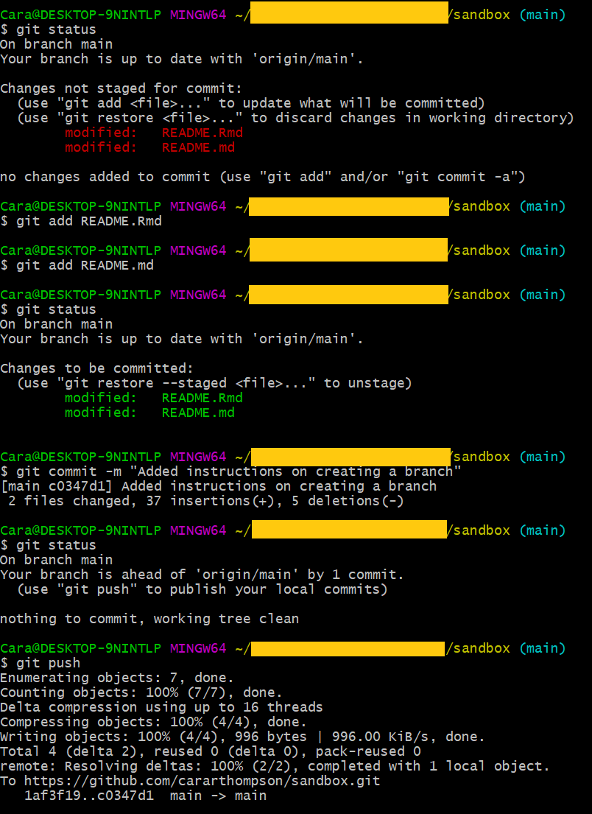
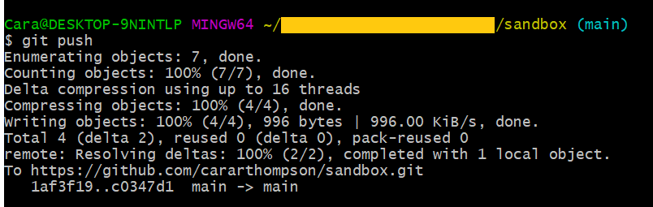
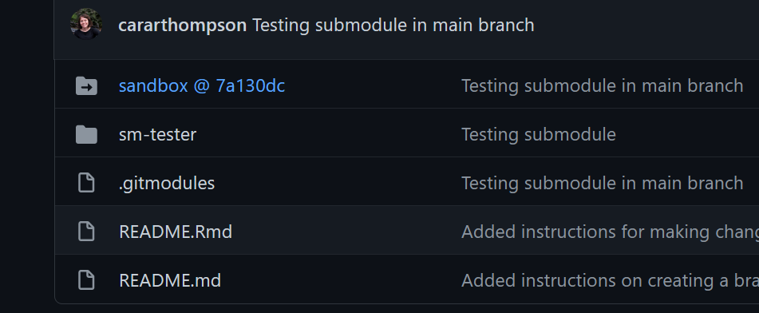
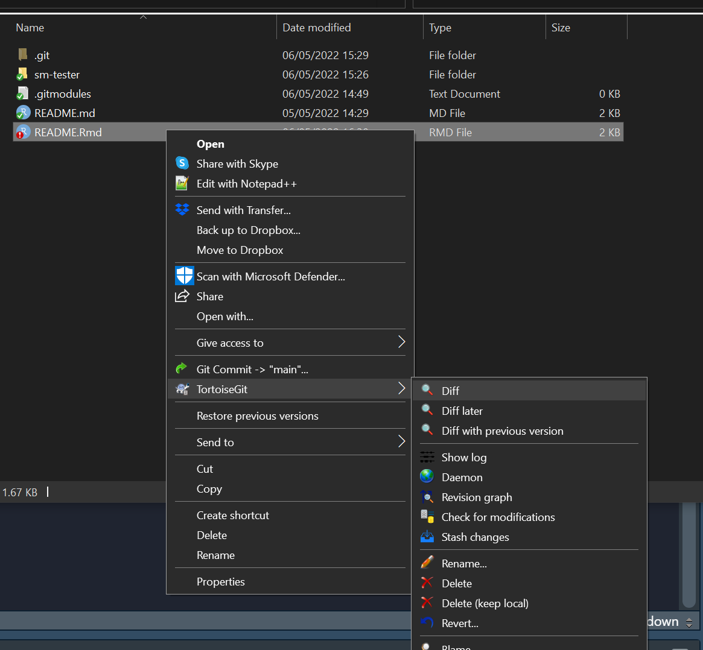
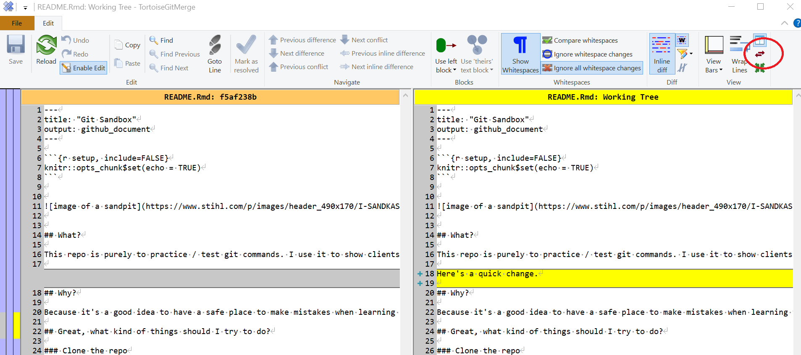

Debugging git - Avenues to explore
================

## What is the main issue?

Try describing it to someone who knows nothing about Git and see if that
unblocks any “aha!” moments.

### When did this start?

Has anything changed since then? (System update, password changes,
anything related to the device(s) you’re using to use Git)

### Is this problem limited to one repo, or does it happen in other repos also?

This can help ascertain whether it’s a credentials / firewall issue

## What is the setup?

### Using Git from the command line or with a GUI?

If you are using the command line, I personally suggest trying to use
GitBash instead of just the command prompt. GitBash should be there from
when you installed Git. It’s what I’m using in the command-line the
screenshots below, and it had handy features like automatically telling
you where you are and what branch you’re in.

### Where is everything?

Ignore the arrow going from “you” to “John” in this diagram. Where is
your local repo? What is your understanding of where the “Central Repo”
is (referred to as “remote” from here in)? Can we take a look at it
where it is hosted?

### Is everyone in the team clear on the difference between “commit” and “push”?

If someone in your team adds things to the repo directly on GitHub, you
do not want to be downloading them manually and adding them to your
local copy, otherwise you’ll have local changes that are also in the
remote and this will confuse Git, and might end up with fun messages
about detached heads. Try making sure you always keep up with what’s in
the repo by using `git pull`, not by doing any manual downloads.

### How you get hold of the repo in the first place?

I’d recommend only ever getting hold of things via `git clone`.
Otherwise you could inherit confusing info from your config files.

### What happens when you add, commit and push?

Try doing this within GitBash (the more git-friendly command line
interface). Here’s what it looks like for me in the “sandbox” repo:

 - Navigate to
the root of the repo (e.g. `cd ../../sandbox`) - What branch name do you
see? (c.f. `(main)` in the image above) - What happens when you run
`git status`? What about `git status -u .` - What about `git status -u`?
(to check for untracked files; files that Git doesn’t yet know about) -
What about `git pull`?

### “Have you tried turning it off and on again?”

A reference to a classic British comedy called the IT Crowd. This is
their answer to most things. And it’s actually not a bad one sometimes.

In our case, it translates to “have you tried cloning the repo fresh?”.
If you did, what happened then? Did you definitely delete (or move!)
everything (including any hidden folders) before you did the clone? Try
cloning to a completely different location and see what happens then.

## A few more common problems

### Git config doesn’t know where “remote” is

Let’s check the remote is the same across everyone’s setup.

    git remote show origin

### The users are getting stuck in Vim and not completing the pull/merge

If you get stuck in Vim (the default text editor associated with
GitBash), to exit, type (don’t try to copy-paste):

    :wq

To change to a more familiar text editor:

    git config --global core.editor path/to/editor

Then check that worked using:

    $EDITOR

This should open your chosen editor if the path is correctly specified.

### The system is left hanging, unable to resolve differences

**What happens when you do a commit and push?**

You should get something like this:

If that doesn’t happen, check for network issues; you may need
assistance with IT for this!

### Files have been moved and Git doesn’t know they exist

It’s absolutely fine to drag and drop files to move them and then tell
Git what you’ve done. All you need to do is `add` the deleted file
(which is just telling it that you’ve deleted it) and then `add` the new
file. It will then know that the file has just moved, so when you next
call `git status` it will show the file as `renamed`. You can then
commit and push, and everyone should have things where they need to be.

A quicker, but more dangerous way to do this, is to add everything (new
files, modifications and any deletions) that have taken place within a
folder. To do that, navigate to the folder and then use:

    git add -A .

You’ll want to then run `git status` to check you’re happy with
everything before you commit! If you’re not, you’ll need to “unstage”
the things you’ve just “staged” (`add`ed - Googling with the term
“unstage” will get you the answer you need!)

### Something fun to do with submodules

Check whether your config file contains a reference to a submodule.
You’re looking for something like this:

    [submodule "path/to/submodule"]

These are rarely used, very complicated, and have been superseded by
better solutions, so generally best avoided. If you are working within a
submodule, the changes won’t be visible to others unless they also track
the submodule, but that’s a more manual process than what you want when
you choose to use Git to make life easier! My suggestion is to try to
get rid of the submodule, but you’ll want to make sure that any changes
you want to hang onto are kept.

If a folder in a repo is a submodule, its icon on github will have an
arrow in it, like this:

If you can’t see that in the remote, the submodule may only be in one
team member’s local copy of the files. We could at this point try some
fancy Git-fu, but I think the best plan is to clone the repo again
ignoring the submodules (which is the default behaviour) and check the
git config again to see if the submodule is still referenced.

If it isn’t referenced anymore, I think we’ve won. If it is, we’ll need
to locate it and get rid of it.

To locate it, there should be a file called `.gitmodules` in the repo
containing a submodule. That file should give you the path to any
submodules that have been created.

Here’s how we get rid of it once we’ve found it.

    # Remove the submodule entry from .git/config
    git submodule deinit -f path/to/submodule

    # Remove the submodule directory from the superproject's .git/modules directory
    rm -rf .git/modules/path/to/submodule

    # Remove the entry in .gitmodules and remove the submodule directory located at path/to/submodule
    git rm -f path/to/submodule

Once we’ve got rid of the submodules, we don’t need to keep the
`.gitmodules` file, so delete that also. Then `add`, `commit` and `push`
and check what things look like on GitHub. Hopefully that’s it gone!

## In starting again (fresh clone) or deleting submodules, are there any changes you want to hang onto?

If so, we’ll need to take a local copy of the repo, delete the existing
one, clone from remote, copy only the things you want to keep back over
from your moved local copy and inspect the changes. You can run
`git diff` to do that. After that point, I’d recommend using a visual
interface like TortoiseGit to look at the differences between the files
you’ve just copied over and the ones they’ve replaced. Install
TortoiseGit, restart the computer, and here’s what you should get when
you right click on a file that is tracked inside a git repo:

Click on `diff`. It will open up something that looks like this, where
you can see what’s changed. You can then highlight sections and choose
which ones to keep by right-clicking and choosing the option you want.
Note the arrows I’ve circled in red. These allow you to switch what is
on what side, which is handy as you can only pull things across from the
left side to the right. Your “working tree” is your file as it is
locally on your computer. The other one is the latest version Git knows
about.

